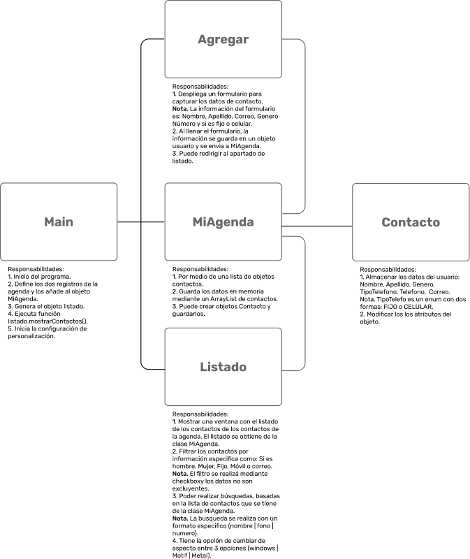
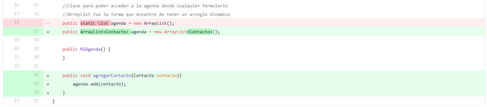
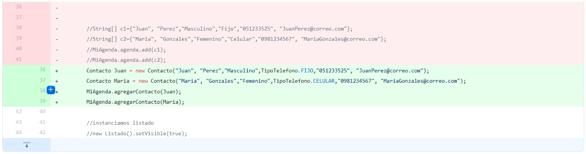
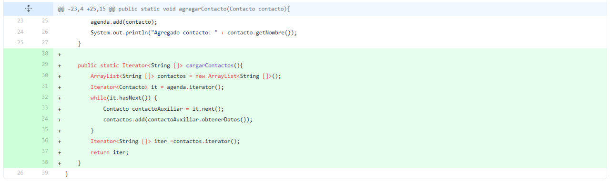
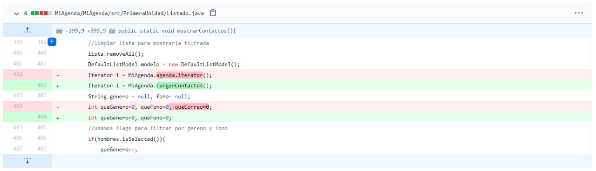
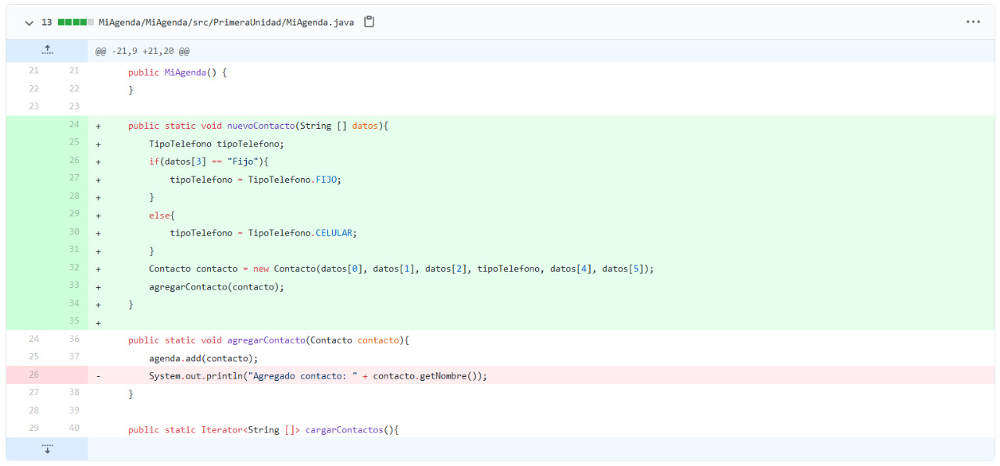
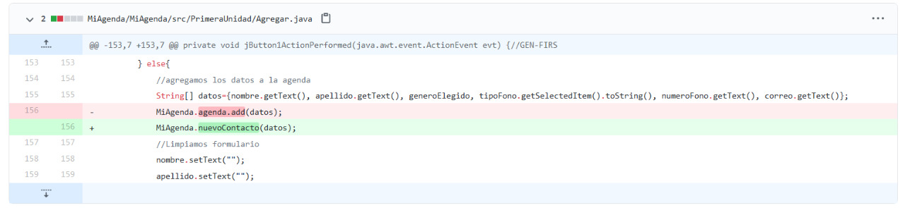
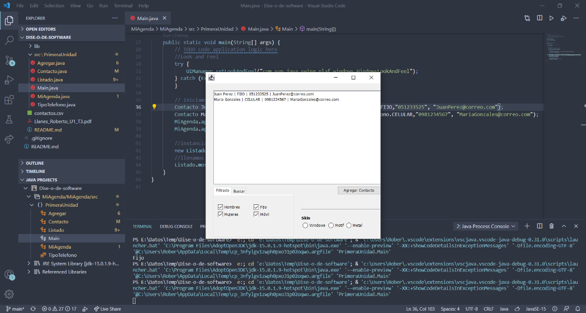
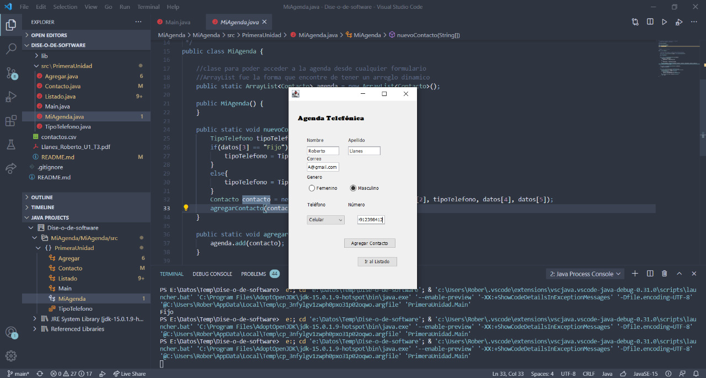
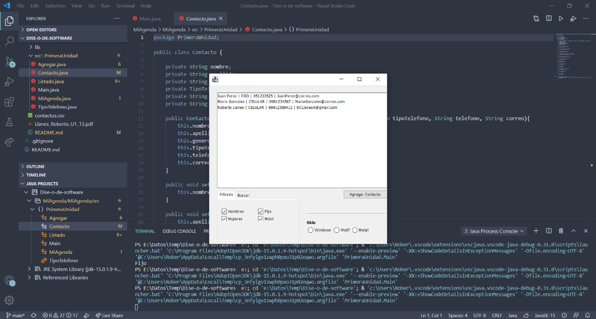

# Feature 1.5.- Agregado Contacto.
## Diagrama de bloques.

<div align = "center">
    


</div>

## Código Fuente.
Si gusta de consultar todos los cambios, pueden ser consultados por los commits del repositorio de github: https://github.com/Apoquinto/Dise-o-de-software/commits/main
Ahora, pasaremos a hacer un repaso rápido del código.
1. Primero añadimos la clase de Contacto.
``` Java
package PrimeraUnidad;

public class Contacto {

    private String nombre;
    private String apellido;
    private String genero;
    private TipoTelefono tipoTelefono;
    private String telefono;
    private String correo;

    public Contacto(String nombre, String apellido, String genero, TipoTelefono tipoTelefono, String telefono, String correo){
        this.nombre = nombre;
        this.apellido = apellido;
        this.genero = genero;
        this.tipoTelefono = tipoTelefono;
        this.telefono = telefono;
        this.correo = correo;
    }

    public void setNombre(String nombre){
        this.nombre = nombre;
    }

    public void setApellido(String apellido){
        this.apellido = apellido;
    }

    public void setGenero(String genero){
        this.genero = genero;
    }

    public void setTipoTelefono(TipoTelefono tipoTelefono){
        this.tipoTelefono = tipoTelefono;
    }
 
    public void setTelefono(String telefono){
        this.telefono = telefono;
    }

    public void setCorreo(String correo){
        this.correo = correo;
    }

    public String getNombre(){
        return nombre;
    }

    public String getApellido(){
        return apellido;
    }

    public String getGenero(){
        return genero;
    }

    public TipoTelefono getTipoTelefono(){
        return tipoTelefono;
    }

    public String getTelefono(){
        return telefono;
    }

    public String getCorreo(){
        return correo;
    }

    // Transforma los datos de la clase en un String dinámico.
    public String[] obtenerDatos(){
        String[] datos = {getNombre(), getApellido(), getApellido(), getTipoTelefono().toString(), getTelefono(), getCorreo()};
        return datos;
    }
}
```

También se tiene que considerar el ENUM para el tipo de telefono:
``` Java
package PrimeraUnidad;

public enum TipoTelefono {
    FIJO("Fijo"), 
    CELULAR("Celular");

    public final String brandName;
    
    TipoTelefono(String brandName){
        this.brandName = brandName;
    }

    /**
     * 
     * @return String
     */
    public String getBrandName(){
        return brandName;
    }
}
```

2. Implementación del ArrayList de contactos.

<div align = "center">
    


</div>

3. Cambiamos la implementación de los contactos base en main.

<div align = "center">
    


</div>

4. Agregamos la función para leer los contactos de MiAgenda, generando el iterador necesario para el listado.

<div align = "center">
    


</div>

5. Cambiamos la generación del iterador, de una instacia directa a generarla mediante la función de MiAgenda.

<div align = "center">
    


</div>

6. Ahora, agregamos en MiAgenda la función para transformar de un String de datos a un objeto contacto.

<div align = "center">
    


</div>

7. Por último, cambiamos la anterior función de guardado por la nueva de la clase MiAgenda.

<div align = "center">
    


</div>

## Capturas de pantalla de ejecución.

Pantalla de inicio.

<div align = "center">
    


</div>

Pantalla de agregar.

<div align = "center">
    


</div>

Contacto guardado.

<div align = "center">
    


</div>